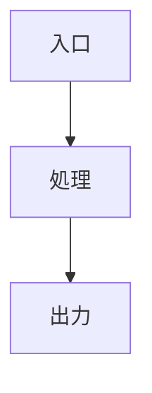

# <タイトル>

<1〜3行で全体像を説明する。>

## 全体図

## 構成要素

| 要素 | 責務 | 実装 |
|---|---|---|
| <名前> | <何をするか> | `<ファイルパス>` |

## データフロー

<どのデータがどこを通ってどう変換されるかを、図または箇条書きで示す。>

## 設計上の制約・前提

- <なぜこの構造なのか。判断の背景が長くなる場合は `Decision Record` に切り出し、`related` で繋ぐ。>
